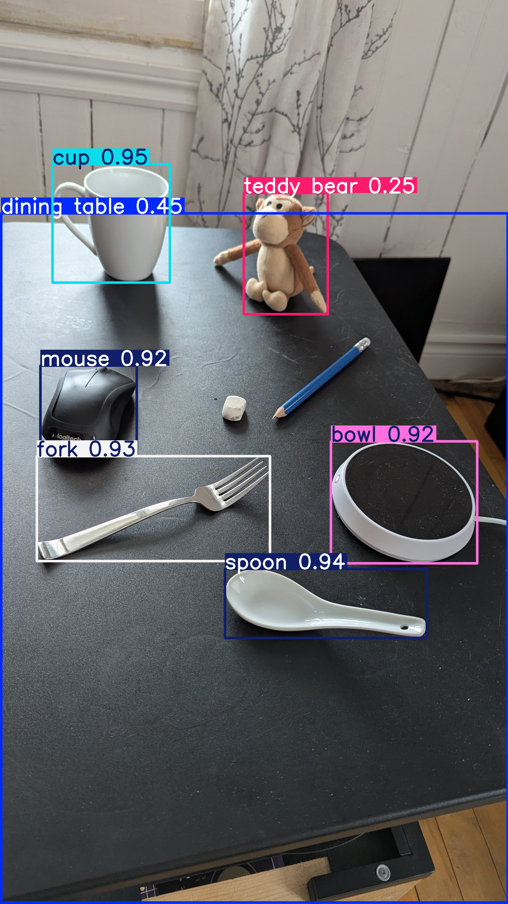
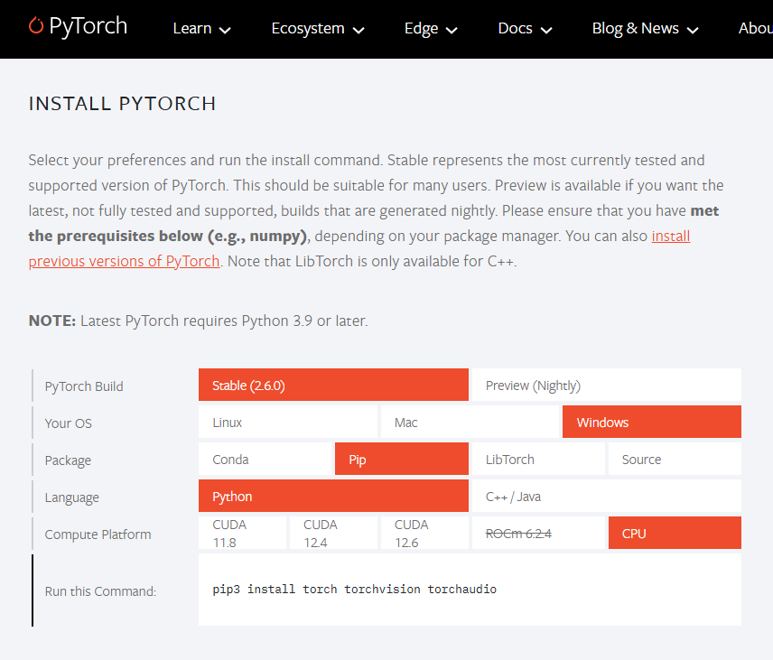

# yolo_project01  


> **⚠️ Work in Progress:** This project is currently under development. Features, functionality, and documentation may change frequently. Thank you for your patience!

[](https://github.com/poivronjaune/BHTP-Tools)


---
Trials and Tribulations of machine learning and object detection in Python  

# Download project  
Your can download the zip file from this repository and unzip it on your computer  
**OR**  
Using git From your preferred workspace, open a CMD (or Powershell) terminal and run git clone.
```
git clone https://github.com/poivronjaune/yolo_project01.git
```
To update with latest version, but this will cause conflicts if you changed the code without use a new branch
```
git pull
```


# Setup python
- Create a python virtual environment with a specific python version (the python version must already be installed on your computer)    
```
py -3.12 -m venv env
```
```
env\Scripts\Activate
py -V
```
Make sure we have the latest pip version  
```
py -m pip install --upgrade pip
```
Install the python setuptools using pip  
```
pip install setuptools
```
The packages required for this project are listed in the requirements.txt file  (this is an older way of installing python packages we can fix this later)  
```
pip install -r requirements.txt
```
Notes: this part is complicated if it does not work directly from the pip command. See the [pytorch official website](https://pytorch.org/) for other installation methods

## Test pytorch installed  
Run the following python script to test if your installation of pytorch and the virtual environment was succesful  
```
py .\torchinstalled.py
```
Result should look like
>PyTorch version: 2.6.0+cpu  
GPU - CUDA Available: False  
Test Tensor created: tensor([1., 2., 3.])  

If you get some message like this, something went wrong. Do not continue and find a way to fix your installation:  
>ModuleNotFoundError: No module named 'torch'

## Detect objects (test01)  
If all the setup steps have been run succesfully, you should be able ti run test01.py. This will generate a result01.jpg file with bounding boxes on detected objects.  
  
Optinal step: activate your python virtual environment (note required if you ran all the setup steps)  
```
env\Scripts\Activate
```
Run the test01.py python script, make sure image01.jpg is in the folder ".\\images\\..."  
```
py test01.py
```  
You should get a file named result01.jpg in the project's root folder that looks like this:  


#
# To Investigate
- How to run using Python 3.13?
- Why do we need the windows C/C++ Compiler, is it possible to have an already compiled component?
- Let'S try to use git without largefile support? [Git Large File Support Link](https://git-lfs.com)
- Pytorch is a complex package and has hardware dependencies for CPU vs GPU [PyTorch Official Web site](https://pytorch.org/)  


# PyTorch Install  
[Pytorch](https://pytorch.org/) official Website  
  
  
Choose your hardware specific parameters to get the proper Run Command.  
***(Print Screen from 2025-03-24. might look different if accessing later than 2025)***